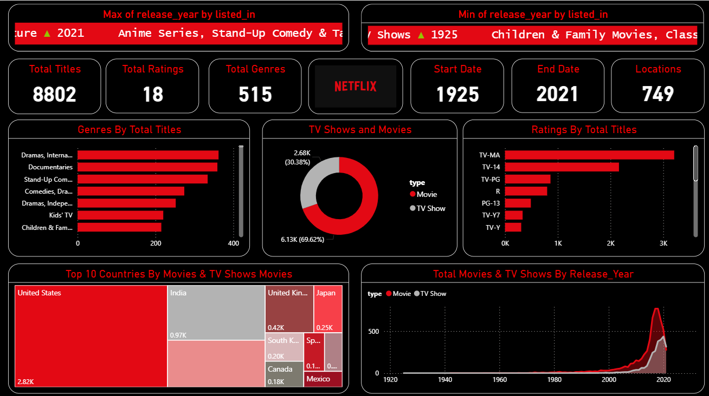

# 🎬 NETFLIX - Movie Data Analysis Project  :-

## 📌 Objective  -->>>>

Netflix is known for its work in data science AI and ml particularly for building strong recommendation models and algorithms that understand customer behaviour and patterns.

## 📊 Dataset  -->>>>

- <a href="https://github.com/dimple-shah-au13/NETFLIX---Movie-Data-Analysis/blob/main/mymoviedb.csv">Dataset</a>

## 🔧 Tools & Libraries  -->>>>

- Python (Pandas, NumPy, Matplotlib, Seaborn)
- csv files
- Jupyter Notebook
- Power BI (for visualization dashboard)

## 📊 Power BI Dashboard Interaction -->>>>

- <a href="https://github.com/dimple-shah-au13/NETFLIX---Movie-Data-Analysis/blob/main/Images/Netflix-Dashboard.png">View Dashboard</a>

## 📈 Exploratory Data Analysis -->>>>

1. What is the most frequent genre of movies released on Netflix?
2. what genres has highest votes?
3. what movie got the highest popularity? what's its genre ?
4. what movie got the lowest popularity ? what's its genre ?
5. which year has the most filmmed movies ?

## 📊 Dashboard  -->>>>

Here’s a preview of the interactive dashboard:

## 💡 Key Insights   -->>>>

Q1: What is the most frequent genre in the dataset?

Drama genre is the most frequent genre in our dataset and has appeared more than
14% of the times among 19 other genres.

💥💥💥💥💥💥💥💥💥💥💥💥

Q2: What genres has highest votes ?
 we have 25.5% of our dataset with popular vote (6520 rows). 
Drama again gets the highest popularity among fans by being having more than 18.5% of movies popularities.

💥💥💥💥💥💥💥💥💥💥💥💥

Q3: What movie got the highest popularity ? what's its Action , genre ?

Spider-Man: No Way Home has the highest popularity rate in our dataset and it has genres of Adventure and Sience Fiction .

💥💥💥💥💥💥💥💥💥💥💥💥

Q4: What movie got the lowest popularity ? what's its genre ?

The united states, thread' has the highest lowest rate in our dataset 
and it has genres of music, drama, 'war', 'sci-fi' and history`.

💥💥💥💥💥💥💥💥💥💥💥💥

Q5: Which year has the most filmmed movies?

year 2020 has the highest filmming rate in our dataset.

